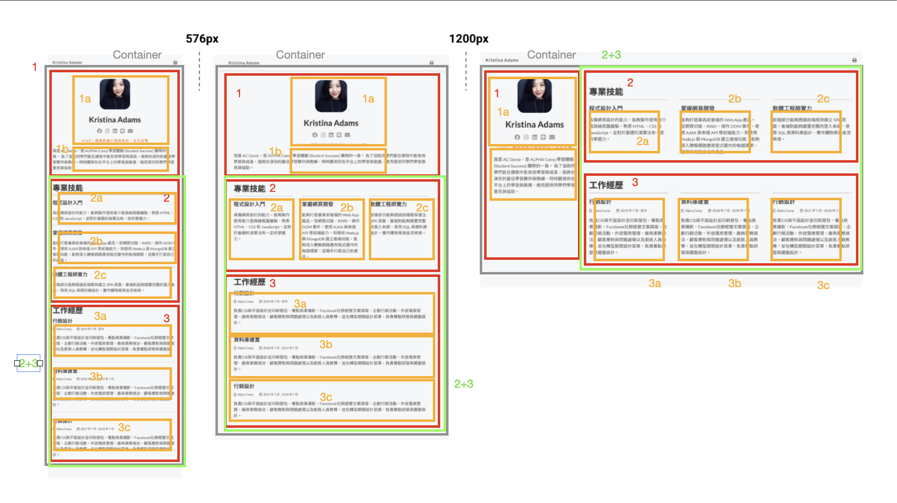

# Alpha Camp Dev C2 M5 - Personal Page RWD

This is a first update solution Dev C4 M1

## Table of contents

- [Overview](#overview)
  - [The challenge](#the-challenge)
  - [Screenshot](#screenshot)
  - [Links](#links)
- [My process](#my-process)
  - [Built with](#built-with)
  - [What I learned](#what-i-learned)
  - [Continued development](#continued-development)
  - [Useful resources](#useful-resources)
- [Author](#author)
- [Acknowledgments](#acknowledgments)

## Overview

### The challenge

Users should be able to:

- RWD by flex setting

### Screenshot



### Links

- Solution URL: [https://github.com/Chious/Dev-C4-M1-Final](https://github.com/Chious/Dev-C4-M1-Final)
- Live Site URL: [https://chious.github.io/Dev-C4-M1-Final/](https://chious.github.io/Dev-C4-M1-Final/)

## My process

### Built with

- Semantic HTML5 markup
- CSS flex

### 處理步驟

1. 定義架構並把原始內容填進去

```html
<div class="container">
  <div class="one">
    <div class="one-a"></div>
    <div class="one-b"></div>
  </div>
  <div class="two-and-three">
    <div class="two">
      <div class="two-a"></div>
      <div class="two-b"></div>
      <div class="two-c"></div>
    </div>
    <div class="three">
      <div class="three-a"></div>
      <div class="three-b"></div>
      <div class="three-c"></div>
    </div>
  </div>
</div>
```

2. 將 container 套用 flex 的配置

```css
.container,
.two,
.three {
  max-width: 1200px;
  display: flex;
  flex-direction: column;
  flex-flow: row wrap;
}
```

3. 承接第一步，設定 RWD 的節點

```css
@media screen and (min-width: 576px) and (max-width: 1199px) {
  ...;
}

@media screen and (min-width: 1200px) {
  ...;
}
```

### What I learned

### 待迭代

1. `.three span` 的字型有跑版，有試過 font-size，不過沒辦法把字型縮小
2. 設計`1200px`以上的版面時，不確定`one`要如何才能佔到 height 的`100%`，後來是用`two-and-three`包起來，不過覺得有點多此一舉。

### Useful resources

## Author

- Github - [邱佳昇](https://github.com/Chious)

## Acknowledgments None
